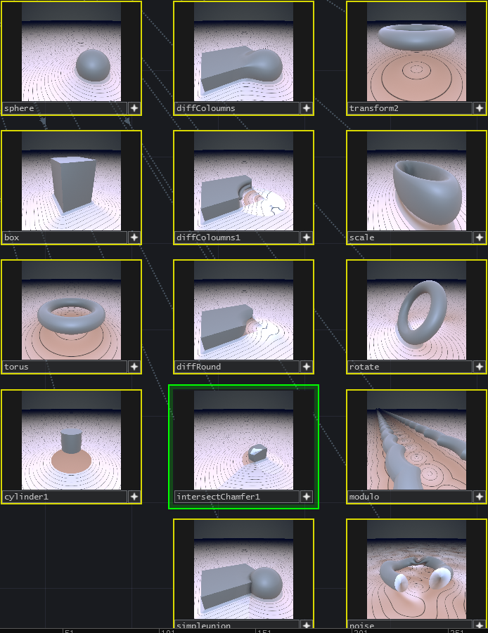

# TDraymarchToolkit
A raymarch Toolkit for TouchDesigner

This is in a very early stage but since some people showed interest in using or even developing further, I'm already putting it here.

Limitations:
- You cannot connect an Operator's output to two inputs.
- You cannot rename OPs without running into problems.
- You cannot encapsulate things (Now that I think of it, maybe you can. It's not tested and used to be impossible.)

If you run into a problem, go inside the corresponding COMP and run the setup DAT, and if its not a generator, the filterSetup DAT afterwards.

Thanks to [mercury.sexy](http://mercury.sexy/), (their library is included here) and [Inigo Quilez](https://www.iquilezles.org/index.html) for all the good articles and formuls.